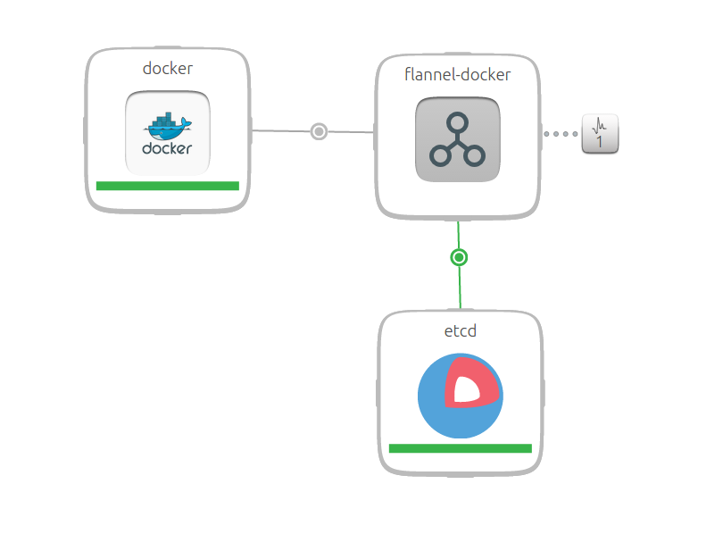

> The over-arching purpose of this particular charm suite is to encapsulate concerns to the best of Juju’s ability, and provide a hot-pluggable solution. Enabling users to change the ‘reference’ configuration with their own services through the rich relationships available on each charm. The charms themselves are simple infra enablers with management nicety through juju actions (unplanned at present)

## Docker

#### Relations

    provides:
      docker-containers:
        interface: containers
    requires:
      network:
        interface: overlay-network
        optional: true
        gets: flannel-subnet, flannel-mtu
      logging:
        interface: docker-socket
        optional: true

#### Primary Language used:
Ansible

#### Config Options:

      latest:
        type: boolean
        default: False
        description: |
          If True, deploy the latest version of docker, when False (default)
          installs docker.io from the Ubuntu package archive.

#### Proposed deployment:

    juju deploy cs:trusty/docker --config="latest=true"

#### Usage post deployment:

    juju run --unit docker/0 "docker run -d --name ttrssdb nornagon/postgres"
    juju run --unit docker/0 "docker run -d --link ttrssdb:db -p 8000:80 clue/ttrss"

## Flannel-Docker

#### Relations

    provides:
      network:
        interface: overlay-network
        scope: container
        sets: flannel-subnet, flannel-mtu, overlay-type
    requires:
      db:
        interface: etcd
        gets: etcd_endpoint, etcd_port
      docker-host:
        interface: juju-info
        scope: container
    peers:
      overlay:
        interface: flannel-mesh

#### Primary Language used:

Ansible

#### Proposed deployment:

    juju deploy cs:trusty/docker --config="latest=true"
    juju deploy cs:trusty/flannel-docker
    juju deploy cs:trusty/etcd
    juju add-relation flannel-docker etcd
    juju add-relation flannel-docker:docker-host docker
    juju add-relation flannel-docker:network docker:network

#### Usage post deployment:

N/A - Subordinate used in SDN for containers. Non-tunable by user.

## ETCD

#### Relations

    provides:
      client:
        interface: etcd
        sets: port, hostname, public_hostname
    peers:
      cluster:
        interface: etcd-raft

#### Config Options:

    options:
      debug:
        type: boolean
        default: true
        description: Enable debug logging
      snapshot:
        type: boolean
        default: true
        description: Enable log snapshots

#### Primary Language used:

Python

#### Proposed deployment:

    juju deploy cs:trusty/etcd --to 0

#### Usage post deployment:

    juju run --service etcd “./health”   -  Returns a health status report on ETCD
    juju add-relation etcd <myservice>

